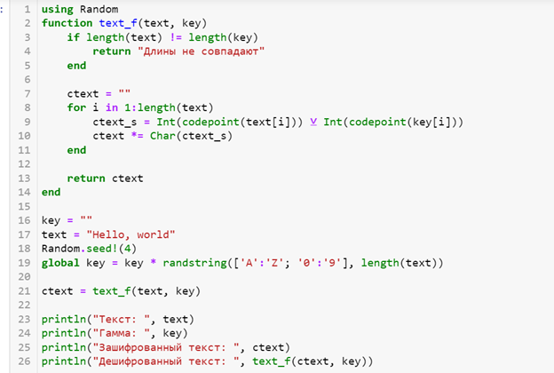

---
## Front matter
lang: ru-RU
title: Математические основы защиты информации и информационной безопасности
author: Роман Сергей Михайлович
institute: РУДН, Москва, Россия

date: 11 Октября 2025

## Formatting
toc: false
slide_level: 2
theme: metropolis
header-includes: 
 - \metroset{progressbar=frametitle,sectionpage=progressbar,numbering=fraction}
 - '\makeatletter'
 - '\beamer@ignorenonframefalse'
 - '\makeatother'
aspectratio: 43
section-titles: true
---

# Лабораторная работа 3

## Шифрование гаммированием

{ #fig:001 width=70% }

## Работа программы

{ #fig:002 width=70% }

## Выводы

- Познакомился с алгоритмом шифрования гаммированием конечной гаммой 

- Применил алгоритм на практике.

## {.standout}

Спасибо за внимание!
